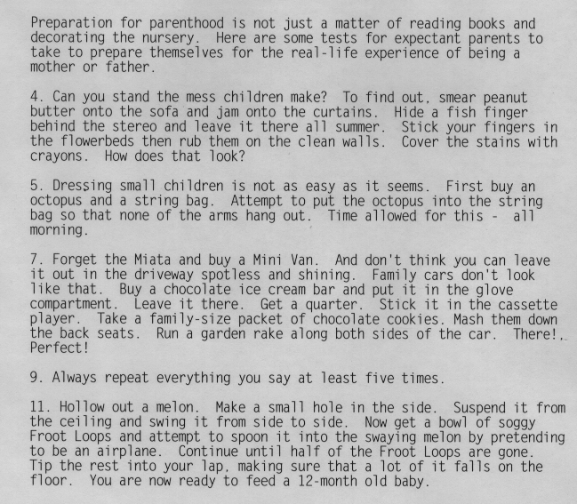
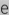
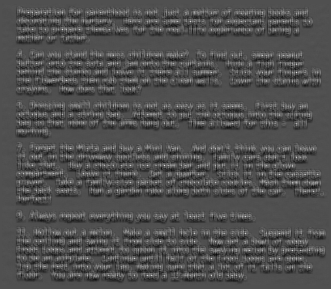
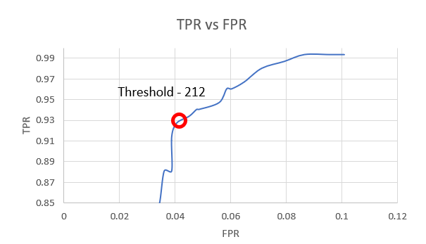
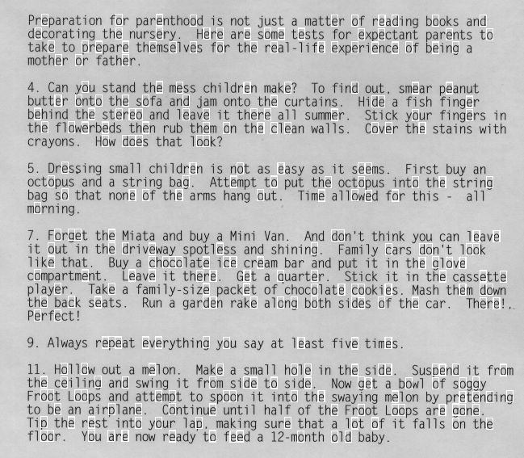

# Optical Character Recognition using Matched Spatial Filter

In this section, Matched Spatial filtering is performed to identify letter "e" in an image that contains a text.
"parenthood.ppm" is the source image in which a paragrah is present. 

"parenthood_e_template.ppm" contains the template image using which MSF is performed on the source image.

Once MSF is performed the image is normalized between 0 to 255.

"parenthood_gt.txt" contains the groundtruth data about the pixel location of different letters in the source image.

For a range of threshold from 0 to 255 the normalized image is looped through and if the pixel value was higher than the threshold it is assumed that letter "e" is detected, this detection is compared against the ground truth data to identify True Positives(TP), True Negative(TN), False Positive(FP), False Negative(FN) and thereby form a truth table.
The TP, TN, FP, FN for differnt threshold are tabulated and generated as "ROC_curve_data" file.

Using the above data True Positive Rate (TPR) vs False Positive Rate (FPR) graph is plotted and it can be seen that performance is optimal at a threshold of 212.

To see the pixels where MSF has detected the letter "e" , detected_img_gen.c file is given, to which normalized_msf image, original image and desired threshold are to be passed as parameter and it generates bounding boxes on the original image based on wherever letter "e" is detected along with a binar image as well indicating the same.

It can be observed that there were quite a lot of False Positive due to similarity in shape between letter letters like "e", "o", "a" etc.

