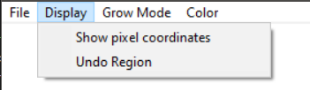
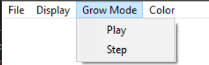
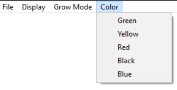

# Interactive Region Growth

This module is built upon the project starter code and stub for queue based region segmentation provided by Dr. Adam Hoover in his course.

The stub for segmentation that uses average value of pixel in the region as predicate for joining a new pixel is first integrated with the project starter code.
The starter code has option to load ppm image and to show the pixel coordinate over which the mouse pointer hovers.

After integrating queue based segmentation code, event handling is added to start a region growth from the spot where mouse is clicked by the user. This is play mode wherein on one click the region grows continously till all the pixels belonging to the region are added.

Next option to undo the region growth and revert back to original image is added as well.

One more mode(step mode) of region growth which is controlled by the user is added, whenever the user presses "j" on keyboard one new adjacent pixel is added to the region.
User can switch between play mode and step mode alternatively.

Option to change colour of the segmented region is also provided to the user, it can be accessed from color menu button. 

dishwasher.ppm image in the prject folder has been used for this demo.

## Procedure
1. This file needs to be opened in MS Visual Studio.

2. Open plus.sln , and in solution explorer window , right click the project and "Retarget Projects".

3. Build -> Build Solution

4. Debug -> start debugging
