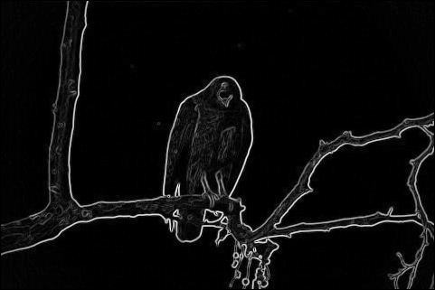

# Active Contour

Rubber band model based active contour algorithm has been implemented here.
The image used here is hawk.ppm, initial set of points around the desired object was provided in initial_points.txt.

The given image is loaded in the program and the initial points are marked as "+" in the imge in black colour.

The algorithm uses 3 energy terms.
1. Internal Energy 1 - square of distance between consecutive points given by
2. Internal Energy 2 - square of difference between average distance of points and distance between consecutive points.
3. External Energy - negative square of edge image derived using Sobel Convolution

The Edge image after applying Sobel convolution is.

After calculating the individual energies they are normalized to between 0 and 1 and the three terms are added together to get total energy.
The contour point is moved to the pixel with the least energy within its window of movement.

The internal energies try to bring the contour points together whereas the external energies try to pull away , a balanced tuning of the weights leads to the right movement of contour points to the edges of the image.
The above energy calculation and movement of points are done for all the contour points and for 30 iterations at the end of which the points settle along the edge of the object of desire.

  
