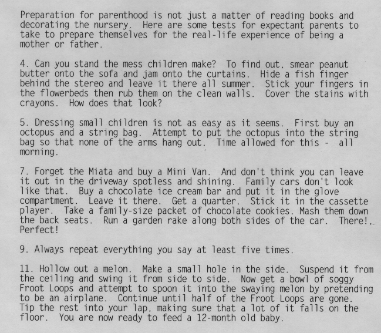
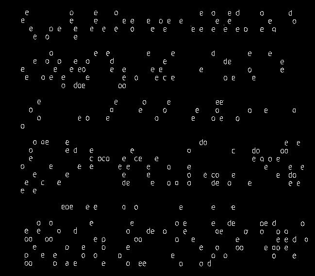
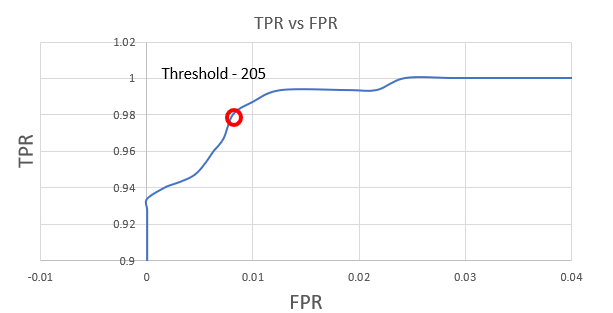
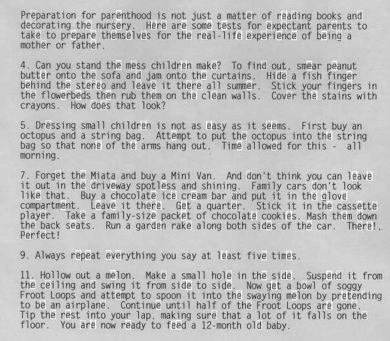

When we try to determine character using Matched Spatial filter (MSF) in previous section there were lot of false positives , in order to reduce that thinning approach is used here.

This is built on top of MSF normalized image. The MSF image data is run through different threshold values and Wherever the MSF process says letter "e" has been detected, a section of the image around the detection pixel is taken and a thinning algorithm is applied to reduce the thickness of letter to single pixel thickness.

Now that the edges have been thinned , edge features can be identified to determine what letter it is. In case of "e" it has got exactly one branch point and one edge point. The number of branch and edge points in the thinned letters are determined , if they don't meet the above condition then that pixel is not anymore considered as letter "e". This way false positive cases have been reduced.

After this the detected pixels are compared against ground truth data to plot Receiver Operating Characteristic (ROC).

It can be inferred that the threshold is optimal at a level of 205.

In order to see the detected letters on the original image "detected_img_gen.c" is given , pass the desired threshold level as parameter and it will generate two images , one thinned image which shows the edges of the letter and another with bounding boxes in the original image around the detected letters.

