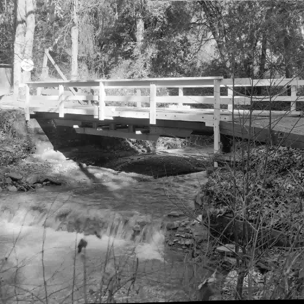

# Image Smoothening 
Code to smoothen out a given image using 3 different convolution methods is deployed and a comparison between their processing times is also done. A greyscale image “bridge.ppm” is used for this purpose, it can be replace with any other .ppm format image as well. Comparison between 3 different convolution methods to smoothen out the given image is done in terms of their processing time and accuracy of the output. 

