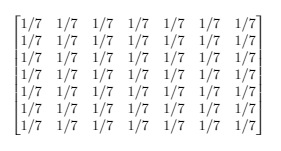
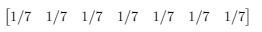
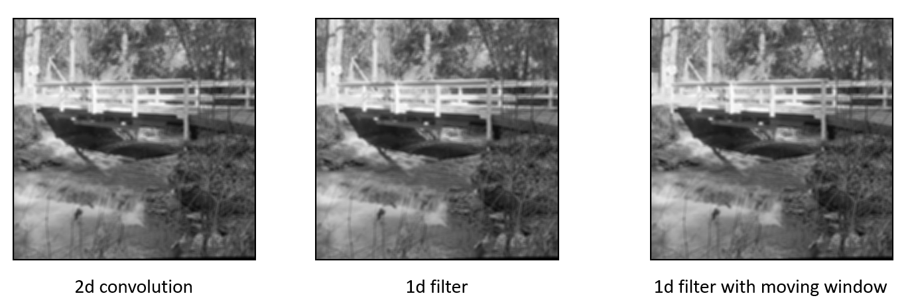

# Image Smoothening 
Code to smoothen out a given image using 3 different convolution methods is deployed and a comparison between their processing times is also done. A greyscale image “bridge.ppm” is used for this purpose, it can be replace with any other .ppm format image as well. Comparison between 3 different convolution methods to smoothen out the given image is done in terms of their processing time and accuracy of the output. 

Input Image - bridge.ppm

The three methods used are as follows.
1. 2d 7x7 Mean filter

2. Seperable filter of size 1x7 & 7x1

3. Seperable filter with a sliding window

To run the code
1. gcc -o <exe_name> <file_name>.c
2. <exe_name>.exe <image_name>.ppm

Output

Processing time
| Method | Time taken |
| ------ | ---------- |
| 2d filter | 33 |
| 1d filter | 15 |
| 1d filter sliding window | 5 |

1d filter with sliding window takes the least time to process because while performing convolution the matrix multiplication does not happen for all the cells in the filter.
Rather the last element contribution is removed and the next element contribution is added.

Using linux command like "diff" will show that there is no difference between all the three output images.
